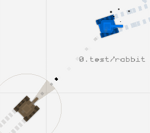
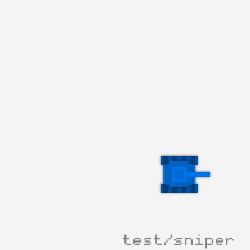

# 🤖 CROBOTS2000 🤖

<p align="center">
  
</p>

A silly remake of the vintage game [CROBOTS](http://tpoindex.github.io/crobots/) with 2D graphics and rigid body physics!

Made for fun with the [OCaml bindings](https://github.com/tjammer/raylib-ocaml) of the [raylib](https://github.com/tjammer/raylib-ocaml) library.

## Play

```bash
dune exec crobots <robot-files>
```

Watch the sample robots in the `test` directory compete, or write and test your own robots!

## Robot API

The physics engine introduces a few changes to the robot API. The robot programming style is a bit different than the original game, in that:

+ The new `heading` primitive can be used to check a robot's current heading

+ A change in a robot's heading is not instantaneous but requires a number of CPU cycles to reach a desired angle.

  In order to make the robot travel on a precise `course` (e.g. towards the top left corner of the field, `135`°), you call the `drive` primitive with a desired speed of 0 to begin turning the robot in place:

  ```c
  drive(course, 0);
  ```

  Cycle until the desired heading is met:

  ```c
  while (heading() != course) ; // do nothing
  ```

  Then set off with your desired speed:

  ```c
  drive(course, speed);
  ```

  The effect of this procedure is shown in the right animation: the robot first rotates then moves in a clean straight line, whereas in the left simulation the robot turns and accelerates at the same time, missing the top-left corner.

  <p align="center">
    
    
  </p>

+ Acceleration takes a few more CPU cycles than the original game. Before testing a robot's speed against 0 (i.e. the robot stopping due to damage or collision), make sure it is actually accelerating (i.e. the robot approaching a non-null speed), otherwise you'd risk stopping the robot unintentionally.
