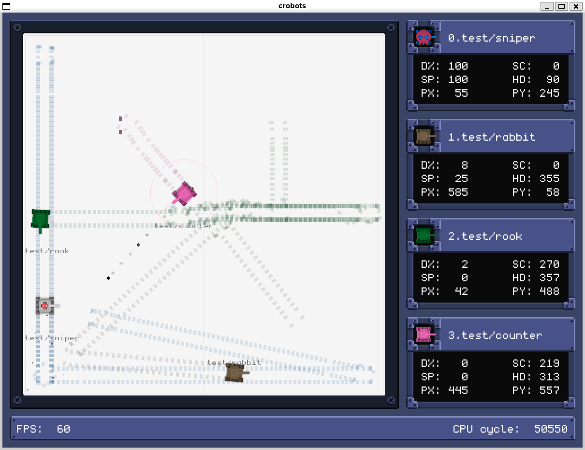
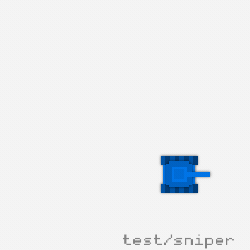

<p align="center">
  <h1>🤖 CROBOTS2000 🤖</h1>
  
</p>

This is a remake of the vintage videogame [CROBOTS](http://tpoindex.github.io/crobots/) made with the [OCaml bindings](https://github.com/tjammer/raylib-ocaml) for the [raylib game engine](https://www.raylib.com/).

## Play

```bash
crobots.exe <robot-programs>
```

Where `<robot-programs>` is a list of file paths containing the source code of the robots that you want to match.

Robot source code is typically stored in text files with the `.r` extension. There are a few historical samples in the [samples directory](samples/).

In the command line below, for example, we make two rabbits and a sniper fight:

```bash
crobots.exe samples/rabbit.r samples/rabbit.r samples/sniper.r
```

Enjoy watching the sample robots compete or creating your own robots!

## Robot API

The robot programming language is a super barebones fragment of the C language, enriched with a number of *intrisic functions* (I prefer the name *Robot API*) that allow the robot to move, fire missiles and locate enemies. 
Check out the Robot API in the [official CROBOTS documentation](https://tpoindex.github.io/crobots/docs/crobots_manual.html#8).

## Differences from the original game

I've introduced a `heading` intrinsic function that can be used to get the robot's current heading.

Due to the different design approach to the physics engine, the programming style in this remake is a bit different than that of the original game, as explained below.

There is angular friction: when you set your robot's heading using the `drive()` intrinsic, it will take a few CPU cycles for you robot to reach the target angle.

So, in order to make the robot travel on a precise route (e.g. towards the top left corner of the field at 135 degrees), you need to call the `drive` primitive with a target speed of 0 to begin turning the robot in place:

```c
drive(course, 0);
```

Cycle until the target heading is reached:

```c
while (heading() != course) ; // do nothing
```

Then set off with your desired speed:

```c
drive(course, speed);
```

The effect of this procedure is shown in the right gif: the robot first rotates then moves in a clean straight line, whereas in the left gif the robot turns and accelerates at the same time, missing the top-left corner.

  <p align="center">
    
    
  </p>

---

## Debugging

To debug or modify this game on your computer you need a working installation of OCaml with the [opam package manager](https://github.com/ocaml/opam) and the [dune build system](https://github.com/ocaml/dune) installed. Once you have that sorted, you can start the game by issuing the command:

```bash
dune exec crobots <robot-programs>
```
